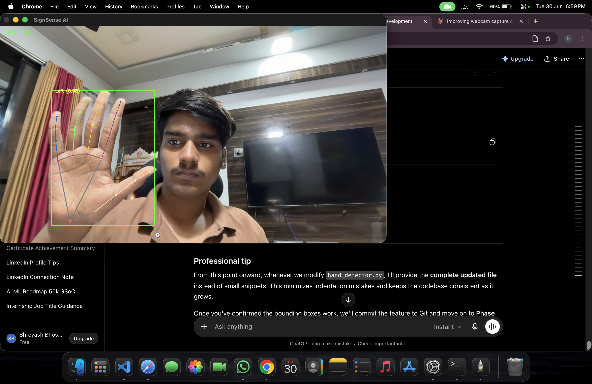
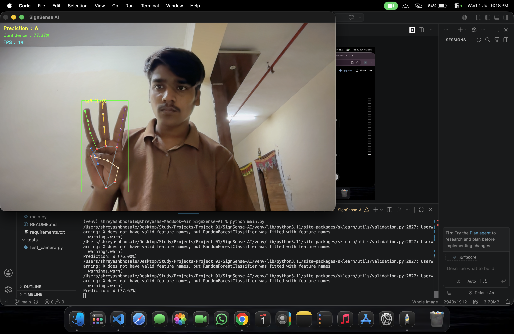
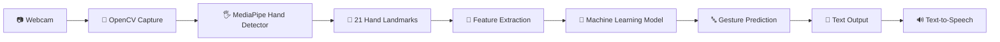
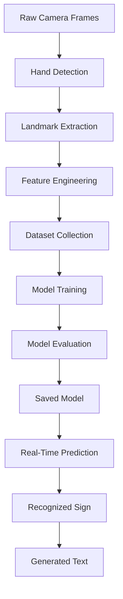
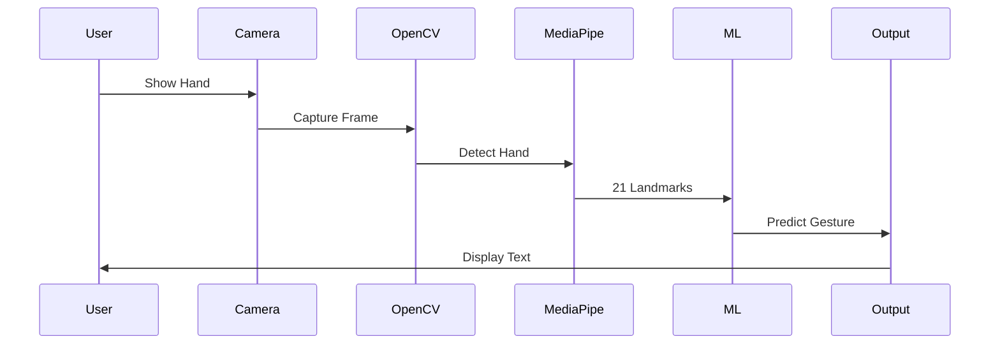

<!-- ========================================================= -->
<!--                       SIGN SENSE AI                       -->
<!-- ========================================================= -->

<h1 align="center">
🤟 SignSense AI
</h1>

<p align="center">

An AI-powered Sign Language Recognition System built using Computer Vision, MediaPipe, Machine Learning, and Python.

Designed to bridge communication gaps by translating hand gestures into readable text in real time.

</p>

---

<p align="center">


</p>

<p align="center">


</p>

---

# 📖 Overview

SignSense AI is a real-time Sign Language Recognition System that leverages Computer Vision and Machine Learning to detect hand landmarks, classify gestures, and convert them into meaningful text.

The long-term vision is to develop an intelligent assistant capable of recognizing:

- English Alphabet (A–Z)
- Numbers
- Common Words
- Dynamic Gestures
- Full Sentences

while providing an intuitive desktop application suitable for accessibility and educational purposes.

The project is built with production-quality software engineering practices including modular architecture, reusable components, and scalable design.

---

# ✨ Key Features

### Current Features

- ✅ Live webcam feed
- ✅ Real-time FPS monitoring
- ✅ MediaPipe hand detection
- ✅ 21 hand landmarks
- ✅ Hand skeleton rendering
- ✅ Modular architecture
- ✅ Clean project structure

### Upcoming Features

- 🔄 Left & Right hand classification
- 🔄 Finger state detection
- 🔄 Gesture recognition
- 🔄 Alphabet recognition
- 🔄 Sentence generation
- 🔄 Text-to-Speech
- 🔄 Voice output
- 🔄 Desktop GUI
- 🔄 Model training pipeline

---

# 📸 Project Preview

## Live Webcam

<p align="center">

</p>

---

## Hand Landmark Detection

<p align="center">

</p>

---

## Prediction Preview

<p align="center">

</p>

---

# 🚀 Why SignSense AI?

This project goes beyond simple hand tracking.

It demonstrates an end-to-end AI application including:

- Computer Vision
- Machine Learning
- Data Collection
- Feature Engineering
- Model Training
- Desktop Software
- Human Computer Interaction

making it a strong portfolio project for AI/ML Engineering roles.

---

# 🛠 Technology Stack

| Category | Technology |
|-----------|------------|
| Language | Python 3.11 |
| Computer Vision | OpenCV |
| Hand Tracking | MediaPipe |
| Machine Learning | Scikit-Learn |
| Data Processing | NumPy |
| Dataset Handling | Pandas |
| GUI | PySide6 |
| Visualization | OpenCV Drawing Utils |
| Version Control | Git |
| Repository | GitHub |

---

# 🏗️ System Architecture

SignSense AI follows a modular and scalable architecture where each component has a dedicated responsibility. This design keeps the codebase maintainable and makes it easier to extend the project with new AI capabilities.



---

# 🧠 Machine Learning Pipeline

The complete AI workflow is designed to move from raw camera input to meaningful language output.



---

# 🏛️ Software Architecture

The project is organized into independent modules to improve readability, testing, and future scalability.

```text
                 +-----------------------+
                 |      main.py          |
                 +----------+------------+
                            |
                            |
        +-------------------+------------------+
        |                                      |
        |                                      |
+-------v--------+                    +--------v--------+
| Camera Module  |                    | Vision Module   |
+-------+--------+                    +--------+--------+
        |                                      |
        |                                      |
        +---------------+----------------------+
                        |
                +-------v--------+
                | Feature Engine |
                +-------+--------+
                        |
                +-------v--------+
                | ML Predictor   |
                +-------+--------+
                        |
                +-------v--------+
                | UI / Output    |
                +----------------+
```

---

# 📂 Repository Structure

```text
SignSense-AI
│
├── assets/
│   ├── webcam-demo.png
│   ├── prediction.png
│   └── hand-landmarks.png
│
├── camera/
│   ├── __init__.py
│   └── camera.py
│
├── datasets/
│
├── models/
│
├── screenshots/
│
├── ui/
│
├── utils/
│
├── vision/
│   ├── __init__.py
│   └── hand_detector.py
│
├── LICENSE
├── README.md
├── requirements.txt
├── main.py
└── .gitignore
```

---

# 📦 Module Overview

| Module | Responsibility |
|---------|----------------|
| **main.py** | Application entry point |
| **camera/** | Webcam initialization and frame capture |
| **vision/** | Hand detection and landmark extraction |
| **datasets/** | Dataset storage and preprocessing |
| **models/** | Trained ML models |
| **ui/** | Desktop interface components |
| **utils/** | Helper functions and utilities |
| **assets/** | Images, GIFs, icons, and documentation assets |

---

# ⚙️ Core Workflow

```text
Initialize Camera
        │
        ▼
Capture Frame
        │
        ▼
Detect Hands
        │
        ▼
Extract 21 Landmarks
        │
        ▼
Generate Features
        │
        ▼
Predict Gesture
        │
        ▼
Convert to Text
        │
        ▼
(Optional)
Speak Prediction
```

---

# 🎯 Current Development Status

| Component | Status |
|-----------|--------|
| Camera Pipeline | ✅ Complete |
| FPS Counter | ✅ Complete |
| MediaPipe Integration | ✅ Complete |
| Hand Landmark Detection | ✅ Complete |
| Hand Skeleton Visualization | ✅ Complete |
| Feature Extraction | 🚧 In Progress |
| Gesture Classification | ⏳ Planned |
| Dataset Collection | ⏳ Planned |
| Model Training | ⏳ Planned |
| Alphabet Recognition | ⏳ Planned |
| Sentence Generation | ⏳ Planned |
| Text-to-Speech | ⏳ Planned |
| Desktop GUI | ⏳ Planned |

---

# 📊 Development Philosophy

SignSense AI is built with the following engineering principles:

- **Modularity** – Each feature is isolated into reusable modules.
- **Scalability** – New models and gestures can be added with minimal changes.
- **Maintainability** – Clean folder organization and readable code.
- **Extensibility** – Ready for future deep learning models and advanced recognition.
- **Performance** – Designed for smooth real-time inference using optimized computer vision techniques.

---

# 🔍 Recognition Pipeline



---
# ⚙️ Installation

## Prerequisites

Before you begin, ensure you have the following installed:

| Requirement | Version |
|--------------|---------|
| Python | 3.11+ |
| Git | Latest |
| Webcam | Required |
| Operating System | Windows, macOS, Linux |

Verify your Python version:

```bash
python --version
```

---

## 1️⃣ Clone the Repository

```bash
git clone https://github.com/shreyash-bhosale/SignSense-AI.git
```

Move into the project directory:

```bash
cd SignSense-AI
```

---

## 2️⃣ Create a Virtual Environment

### macOS / Linux

```bash
python3 -m venv .venv
```

### Windows

```powershell
python -m venv .venv
```

---

## 3️⃣ Activate the Environment

### macOS / Linux

```bash
source .venv/bin/activate
```

### Windows (Command Prompt)

```cmd
.venv\Scripts\activate
```

### Windows (PowerShell)

```powershell
.venv\Scripts\Activate.ps1
```

---

## 4️⃣ Install Dependencies

Upgrade pip:

```bash
python -m pip install --upgrade pip
```

Install the required packages:

```bash
pip install -r requirements.txt
```

---

## 5️⃣ Run the Application

```bash
python main.py
```

If everything is configured correctly:

- Webcam opens automatically
- Hand landmarks are displayed
- FPS counter is visible
- Press **Q** to quit

---

# 🚀 Quick Start

```text
Clone Repository
        │
        ▼
Create Virtual Environment
        │
        ▼
Activate Environment
        │
        ▼
Install Dependencies
        │
        ▼
Run main.py
        │
        ▼
Allow Camera Access
        │
        ▼
Show Your Hand
        │
        ▼
Observe Landmark Detection
```

---

# 💻 Usage

### Launch the Application

```bash
python main.py
```

### Position Your Hand

- Keep your hand inside the camera frame.
- Ensure good lighting.
- Avoid excessive motion blur.
- Face your palm toward the camera for best results.

---

### Expected Output

The application will:

- Detect one or more hands.
- Draw the 21 MediaPipe landmarks.
- Connect landmarks with the hand skeleton.
- Display the current FPS.
- Prepare extracted landmarks for future gesture prediction.

---

# 📊 Performance Dashboard

| Metric | Current Status |
|----------|---------------|
| Camera Initialization | ✅ Stable |
| Live Video Feed | ✅ Working |
| FPS Counter | ✅ Implemented |
| Hand Detection | ✅ Working |
| Landmark Detection | ✅ 21 Landmarks |
| Multi-Hand Support | 🚧 In Progress |
| Gesture Prediction | ⏳ Planned |
| Text Output | ⏳ Planned |
| Speech Output | ⏳ Planned |

---

# 📈 Current Capabilities

| Feature | Status |
|---------|--------|
| Webcam Capture | ✅ |
| OpenCV Integration | ✅ |
| MediaPipe Hands | ✅ |
| Landmark Rendering | ✅ |
| FPS Display | ✅ |
| Feature Vector Generation | 🚧 |
| Dataset Recording | ⏳ |
| Model Training | ⏳ |
| Gesture Classification | ⏳ |
| Sentence Recognition | ⏳ |

---

# 📸 Sample Workflow

```text
User Opens Application

        │

        ▼

Camera Starts

        │

        ▼

Frame Captured

        │

        ▼

Hand Detected

        │

        ▼

21 Landmarks Extracted

        │

        ▼

Skeleton Drawn

        │

        ▼

Display FPS

        │

        ▼

Ready for Gesture Recognition
```

---

# 🧪 Testing

To verify the application is functioning correctly:

- Camera launches without errors.
- Live video feed is visible.
- Hand landmarks appear when a hand enters the frame.
- FPS counter updates continuously.
- Pressing **Q** closes the application gracefully.

---

# 📝 Known Limitations

Current limitations include:

- Gesture classification is not yet implemented.
- Text generation is under development.
- Text-to-Speech support is planned.
- Performance may vary under poor lighting conditions.
- Only basic hand tracking functionality is currently available.

These features are actively being developed as part of the project roadmap.

---

# 📊 Future Performance Goals

| Objective | Target |
|-----------|--------|
| Detection FPS | 30+ FPS |
| Gesture Accuracy | >95% |
| Recognition Latency | <100 ms |
| Alphabet Coverage | A–Z |
| Number Recognition | 0–9 |
| Sentence Recognition | Basic Phrases |
| Cross-Platform Support | Windows, macOS, Linux |

---

# 🔧 Configuration

Future configurable options will include:

```text
Settings
│
├── Camera Index
├── Camera Resolution
├── FPS Limit
├── Detection Confidence
├── Tracking Confidence
├── Prediction Confidence
├── Theme
├── Keyboard Shortcuts
└── Language
```

---

# 📚 Learning Objectives

This project is designed to strengthen practical skills in:

- Computer Vision
- Machine Learning
- Python Development
- Software Architecture
- Data Collection
- Feature Engineering
- Model Deployment
- Real-Time AI Systems
- Git & GitHub Collaboration

---

# 🎯 Project Milestones

| Milestone | Progress |
|-----------|----------|
| Project Initialization | ✅ Completed |
| Camera Module | ✅ Completed |
| Vision Module | ✅ Completed |
| Hand Tracking | ✅ Completed |
| Feature Engineering | 🚧 In Progress |
| Dataset Collection | ⏳ Planned |
| Model Training | ⏳ Planned |
| Real-Time Classification | ⏳ Planned |
| Desktop Application | ⏳ Planned |
| Version 1.0 Release | ⏳ Planned |

---
# 🛣️ Development Roadmap

The project is being developed incrementally, with each phase building upon the previous one. The roadmap below outlines the planned progression toward a complete AI-powered Sign Language Recognition System.

---

## ✅ Phase 1 — Foundation

- [x] Initialize Git repository
- [x] Configure project structure
- [x] Create virtual environment
- [x] Configure dependencies
- [x] Camera integration using OpenCV
- [x] Real-time video capture
- [x] FPS counter
- [x] Graceful application exit

---

## ✅ Phase 2 — Hand Detection

- [x] MediaPipe Hands integration
- [x] Detect one hand
- [x] Detect multiple hands
- [x] Draw hand skeleton
- [x] Draw 21 landmarks
- [x] Landmark indexing

---

## 🚧 Phase 3 — Feature Engineering

- [ ] Normalize landmark coordinates
- [ ] Finger angle calculation
- [ ] Distance-based features
- [ ] Palm center extraction
- [ ] Finger state detection
- [ ] Feature vector generation

---

## ⏳ Phase 4 — Dataset Collection

- [ ] Capture gesture samples
- [ ] Automatic image labeling
- [ ] Dataset augmentation
- [ ] CSV export
- [ ] Dataset validation
- [ ] Data visualization

---

## ⏳ Phase 5 — Machine Learning

- [ ] Data preprocessing
- [ ] Feature scaling
- [ ] Model training
- [ ] Hyperparameter tuning
- [ ] Cross-validation
- [ ] Model serialization
- [ ] Accuracy evaluation

---

## ⏳ Phase 6 — Gesture Recognition

- [ ] Static gesture recognition
- [ ] Alphabet recognition (A–Z)
- [ ] Number recognition (0–9)
- [ ] Common word recognition
- [ ] Confidence score display

---

## ⏳ Phase 7 — Natural Language Processing

- [ ] Sentence generation
- [ ] Word prediction
- [ ] Grammar correction
- [ ] Context-aware recognition

---

## ⏳ Phase 8 — Accessibility Features

- [ ] Text-to-Speech
- [ ] Speech customization
- [ ] Recognition history
- [ ] Export recognized text
- [ ] Dark mode
- [ ] Keyboard shortcuts

---

# 🚀 Future Enhancements

The long-term vision includes expanding SignSense AI into a comprehensive accessibility platform.

Potential future enhancements:

- 🌐 Cloud model deployment
- 📱 Mobile application
- 🎥 Video file recognition
- 🎙️ Voice commands
- 🧠 Deep learning models
- 🤖 Transformer-based recognition
- ☁️ Online model updates
- 📊 Analytics dashboard
- 🌍 Multi-language support
- 🧩 Plugin architecture

---

# 🤝 Contributing

Contributions are welcome and appreciated.

If you'd like to improve the project:

1. Fork the repository.
2. Create a new feature branch.

```bash
git checkout -b feature/your-feature
```

3. Commit your changes.

```bash
git commit -m "feat: add amazing feature"
```

4. Push your branch.

```bash
git push origin feature/your-feature
```

5. Open a Pull Request describing your changes.

---

# 📋 Contribution Guidelines

Please follow these guidelines when contributing:

- Keep commits focused and meaningful.
- Write clean, readable code.
- Add comments where appropriate.
- Follow existing project structure.
- Test your changes before submitting.
- Update documentation if necessary.

---

# 🧹 Code Style

This project follows standard Python best practices:

- PEP 8 compliant
- Modular architecture
- Type hints where applicable
- Descriptive variable names
- Reusable functions
- Consistent formatting

Recommended tools:

- Black
- Ruff
- isort
- pylint

---

# 🔒 Security

If you discover a security vulnerability, please report it responsibly rather than creating a public issue.

Do not include API keys, credentials, or sensitive information in commits.

---

# 🧪 Testing Strategy

Future versions of the project will include:

- Unit tests
- Integration tests
- Performance benchmarks
- Model validation tests
- Continuous Integration (CI)

Testing tools planned:

- pytest
- GitHub Actions
- coverage.py

---

# ❓ Frequently Asked Questions

### Which programming language is used?

Python 3.11+

---

### Does the project require a GPU?

No.

The current implementation runs entirely on CPU.

Future deep learning models may optionally support GPU acceleration.

---

### Which operating systems are supported?

- Windows
- macOS
- Linux

---

### Is internet access required?

No.

All current processing happens locally on your machine.

---

### Can I use this project for learning?

Absolutely.

The repository is designed to demonstrate practical applications of:

- Computer Vision
- Machine Learning
- Python Development
- Software Engineering

---

# 🙏 Acknowledgements

This project builds upon the excellent work of the open-source community.

Special thanks to:

- OpenCV
- MediaPipe
- NumPy
- Pandas
- Scikit-learn
- Python Community
- GitHub

Without these projects, SignSense AI would not be possible.

---

# 🌟 Why This Project Matters

Communication barriers continue to affect millions of people worldwide.

The vision behind SignSense AI is to leverage Artificial Intelligence and Computer Vision to make communication more accessible, intuitive, and inclusive.

Beyond serving as an AI engineering portfolio project, SignSense AI aims to explore practical technology that can contribute to accessibility and assistive communication.

Every milestone completed brings the project one step closer to becoming a real-world solution rather than just a technical demonstration.

---
# 📜 License

This project is licensed under the **MIT License**.

You are free to:

- ✅ Use
- ✅ Modify
- ✅ Distribute
- ✅ Fork
- ✅ Learn from

this project under the terms of the MIT License.

See the [LICENSE](LICENSE) file for complete details.

---

# 👨‍💻 Author

<div align="center">

## Shreyash Bhosale

**AI & Machine Learning Student**

Building practical AI applications with a focus on:

🤖 Artificial Intelligence • 👁️ Computer Vision • 🧠 Machine Learning • 🐍 Python • 📊 Data Science

</div>

---

## 🌐 Connect With Me

<p align="center">

<a href="https://github.com/shreyash-bhosale">

</a>

<a href="https://www.linkedin.com/in/shreyash-bhosale-3b395041a/">

</a>

<a href="mailto:shreyashbhosale592@gmail.com">

</a>

</p>

---

# ⭐ Support the Project

If you found this repository useful or interesting, consider supporting it by:

- ⭐ Starring the repository
- 🍴 Forking the project
- 🐛 Reporting bugs
- 💡 Suggesting new features
- 📢 Sharing it with others
- 🤝 Contributing improvements

Your support helps improve the project and motivates continued development.

---

# 📬 Feedback

Feedback, ideas, and constructive suggestions are always welcome.

If you'd like to contribute, report an issue, or discuss improvements, feel free to open an Issue or Pull Request on GitHub.

---

# 🎯 Project Vision

SignSense AI is more than a gesture recognition project.

The long-term objective is to build an intelligent accessibility platform capable of understanding sign language in real time through modern Computer Vision and Machine Learning techniques.

Future versions aim to support:

- Full alphabet recognition
- Continuous sentence recognition
- Speech synthesis
- Multiple sign languages
- Mobile deployment
- Cloud inference
- Deep learning models
- Real-world accessibility applications

---

# 📈 Repository Status

| Category | Status |
|----------|--------|
| Development | 🚧 Active |
| Maintained | ✅ Yes |
| Open Source | ✅ Yes |
| Contributions | 🤝 Welcome |
| License | MIT |
| Python Version | 3.11+ |

---

# 🗂️ Release Plan

| Version | Description |
|----------|-------------|
| v0.1 | Camera & Hand Detection |
| v0.2 | Feature Engineering |
| v0.3 | Dataset Collection |
| v0.4 | ML Model Training |
| v0.5 | Gesture Recognition |
| v0.6 | Alphabet Recognition |
| v0.7 | Sentence Generation |
| v1.0 | Stable Public Release |

---

# 💡 Inspiration

Technology should make communication more accessible.

SignSense AI is inspired by the idea that Artificial Intelligence can help bridge communication gaps and create more inclusive digital experiences.

The project also serves as a hands-on exploration of real-world AI engineering, combining computer vision, machine learning, software architecture, and user-centered design into a single application.

---

<div align="center">

## 🚀 Thanks for Visiting!

If you enjoyed this project, please consider giving it a ⭐ on GitHub.

It helps others discover the project and supports its continued development.

---

**Made with ❤️, Python, Computer Vision, and Machine Learning**

**© 2026 Shreyash Bhosale**

</div>