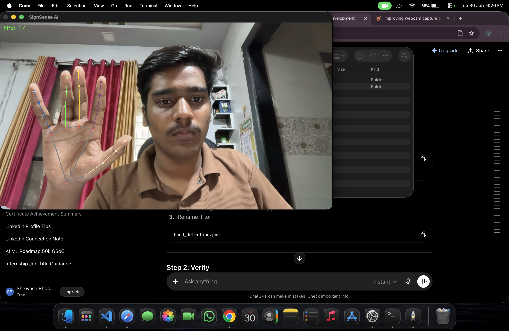
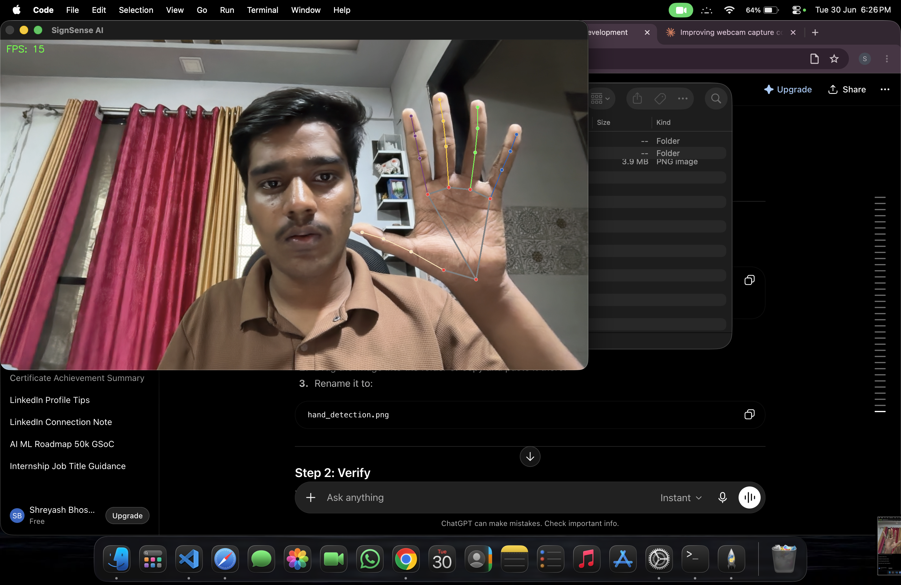

# 🤟 SignSense AI

> An AI-powered Sign Language Recognition System using Computer Vision and Machine Learning.


---

## 📖 Overview

**SignSense AI** is a desktop application that recognizes hand signs in real time using a webcam and converts them into readable text.

The long-term vision of this project is to build a complete Sign Language Recognition System capable of recognizing the English alphabet (A–Z), numbers, common words, and full sentences, with speech output and a modern desktop interface.

This project is being developed as a professional AI/ML portfolio project with clean architecture, modular code, and production-quality practices.

---

## ✨ Current Features

- ✅ Live webcam feed
- ✅ FPS counter
- ✅ MediaPipe hand detection
- ✅ 21 hand landmarks
- ✅ Hand skeleton visualization
- 🔄 Left/Right hand detection (Coming Soon)
- 🔄 Finger state detection
- 🔄 Gesture recognition
- 🔄 Sign language recognition
- 🔄 Text-to-Speech

---

## 🛠 Tech Stack

| Category | Technology |
|----------|------------|
| Language | Python 3.11 |
| Computer Vision | OpenCV |
| Hand Tracking | MediaPipe |
| Machine Learning | Scikit-Learn |
| Data Processing | NumPy, Pandas |
| GUI | PySide6 |
| Version Control | Git & GitHub |

---

## 📂 Project Structure

```text
SignSense-AI/

├── assets/
├── camera/
├── datasets/
├── models/
├── screenshots/
├── ui/
├── utils/
├── vision/
│   └── hand_detector.py
│
├── LICENSE
├── README.md
├── main.py
├── requirements.txt
└── .gitignore
```

---

## 📸 Screenshots

### Hand Detection



---

## 🚀 Installation

### 1. Clone the repository

```bash
git clone https://github.com/YOUR_USERNAME/SignSense-AI.git
```

### 2. Move into the project

```bash
cd SignSense-AI
```

### 3. Create a virtual environment

```bash
python3.11 -m venv venv
```

### 4. Activate the environment

**macOS/Linux**

```bash
source venv/bin/activate
```

### 5. Install dependencies

```bash
pip install -r requirements.txt
```

### 6. Run the application

```bash
python main.py
```

---

## 🗺 Development Roadmap

### ✅ Phase 1 — Camera

- Live webcam
- FPS Counter
- Camera cleanup

### 🚧 Phase 2 — Hand Detection

- Hand detection
- Hand landmarks
- Left/Right hand detection
- Multiple hands

### ⏳ Phase 3 — Hand Tracking

- Finger positions
- Finger states
- Finger counting
- Palm center

### ⏳ Phase 4 — Gesture Recognition

- 👍 Thumbs Up
- ✌️ Peace
- 👌 OK
- ✊ Fist
- 🖐 Open Palm
- ☝️ Pointing

### ⏳ Phase 5 — Dataset Collection

- Image capture
- Gesture labeling
- Dataset export

### ⏳ Phase 6 — Machine Learning

- Train gesture classifier
- Save trained model
- Predict gestures

### ⏳ Phase 7 — Sign Language Recognition

- Alphabet (A–Z)
- Numbers
- Common words
- Sentence generation

### ⏳ Phase 8 — Desktop UI

- Modern PySide6 interface
- Recognition history
- Confidence indicator
- Settings panel
- Keyboard shortcuts

---

## 🎯 Project Goals

- Build a production-quality AI application.
- Learn Computer Vision and Machine Learning.
- Create an impressive GitHub portfolio project.
- Demonstrate clean software architecture.
- Showcase real-world AI engineering skills.

---

## 👨‍💻 Developer

**Shreyash Bhosale**

AI & Machine Learning Student

- GitHub: *(Coming Soon)*
- LinkedIn: *(Coming Soon)*

---

## 📄 License

This project is licensed under the MIT License.

See the **LICENSE** file for details.